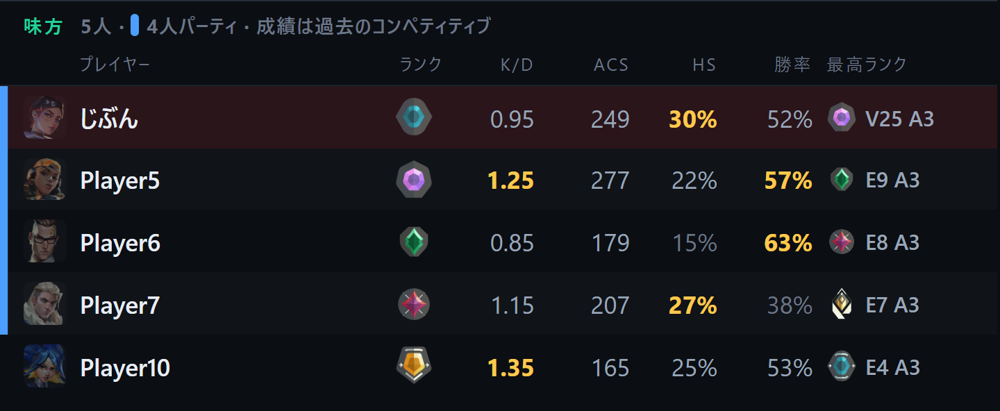

# VALOTRACK

**自分の PC で動く、VALORANT の戦績トラッカー。無料・Windows 用。**
A free VALORANT stats tracker that runs on your Windows PC.

[**ダウンロード / Download**](https://rilfyin.github.io/VALOTRACK/VALOTRACK-Setup.exe) ·
[サイト / Website](https://rilfyin.github.io/VALOTRACK/) ·
[これまでの版 / Releases](https://github.com/rilfyin/VALOTRACK/releases)



## できること

- **ピック中のオーバーレイ** … エージェント選択の間だけ、味方のランク・K/D・ACS・HS率・勝率をゲーム画面の上に表示。試合が始まれば自動で消えます
- **ライブ** … 試合中の10人全員の現ランク・最高ランク・直近の成績、組んで来ているパーティ
- **ホーム** … ランクと RR、このセッションの成績、勝率・K/D・ACS・HS率。モードとアクトで絞り込み（モードはまぜません）
- **試合のふりかえり** … ふだんの自分と比べて、直すことと、できていたことを具体的に
- **引き伸ばし解像度** … ワンクリックで切り替え。VALORANT の起動・終了に合わせて自動でも。彩度も一緒に
- **Discord 表示** … モード・マップ・スコア・ランクをプロフィールに
- ほかにも 定点・クロスヘア・作戦盤・プレイヤー検索・e-Sports・エイム練習（VALOAIM）など。日本語 / English 対応

## 入れ方

1. [VALOTRACK-Setup.exe](https://rilfyin.github.io/VALOTRACK/VALOTRACK-Setup.exe) をダウンロード
2. 実行する（「Windows によって PC が保護されました」と出たら「詳細情報」→「実行」。署名の無い個人製作のアプリのため出ます）
3. Riot クライアントにログインした状態で VALOTRACK を開く

**動作環境:** Windows 10 / 11（64 bit）· Microsoft Edge WebView2（Windows 11 は標準）· Riot クライアント

新しい版が出ると、アプリが自動で知らせます。前の版に戻したい時は [Releases](https://github.com/rilfyin/VALOTRACK/releases) から入れ直してください（保存してある戦績はそのまま残ります）。

## よくある質問

**無料ですか？** はい。

**データはどこに保存されますか？** 自分の PC の中だけです。VALOTRACK 独自のサーバーはなく、戦績をどこかへ送ることもありません。

**ゲームやアカウントに影響はありますか？** ゲームのファイルやメモリには触れず、Riot クライアントが PC の中で使っている情報を読み取るだけです（解像度タブを使った時だけ、VALORANT の設定ファイルの解像度を書き換えます）。ただし Riot Games 公式のツールではないため、ご利用は自己責任でお願いします。

---

Created by **Rilfyin** · Developed by **koppepandayo**

<sub>VALOTRACK isn't endorsed by Riot Games and doesn't reflect the views or opinions of Riot Games or anyone officially involved in producing or managing Riot Games properties. Riot Games, and all associated properties are trademarks or registered trademarks of Riot Games, Inc.</sub>

---

<details>
<summary><b>配布の手順（開発者向け）</b></summary>

このリポジトリは配布物の置き場です。アプリのソースはここにはありません。GitHub Pages（`main` ブランチの `/docs`）で公開しています。

| ファイル | 役割 |
|---|---|
| `docs/manifest.json` | アプリが起動時に見に行くファイル（最新の版・入手先・変更点）。**場所を変えないこと** |
| `docs/VALOTRACK-Setup.exe` | インストーラー本体。**場所を変えないこと** |
| `docs/ranks/` | Discord 表示で使うランクの画像。**場所を変えないこと** |
| `docs/index.html` | 利用者向けのページ |
| `docs/admin.html` | 管理ページ（manifest.json の確認・作成） https://rilfyin.github.io/VALOTRACK/admin.html |
| `docs/img/` | サイトと README の画像 |
| `push-to-github.ps1` | `docs/` の中身を GitHub へ送るスクリプト |

### 新しい版を出す

1. ソース側（`C:\building\VALOTRACK\src`）で `app\release.ps1` を実行する。インストーラーを作り、`docs/VALOTRACK-Setup.exe` と `docs/manifest.json` を書き換える

   ```
   .\release.ps1 -Version 2.23.1 -Notes "変更点1|変更点2" -NotesEn "change 1|change 2"
   ```

2. このフォルダで送る

   ```
   powershell -File push-to-github.ps1
   ```

3. Releases にも置く（前の版を残すため）

   ```
   gh release create v2.23.1 "docs/VALOTRACK-Setup.exe#VALOTRACK-Setup.exe" --target main --title "VALOTRACK 2.23.1" --notes "…"
   ```

- 版は必ず上げる（同じか小さい番号だと、利用者のアプリが更新に気づかない）。比較は数字ごとなので `2.10.0` は `2.9.0` より新しい扱い
- `manifest.json` と exe は誰でも読める必要がある（利用者のアプリはログインできないため）

</details>
